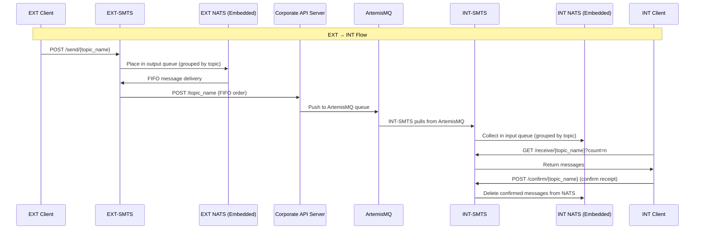
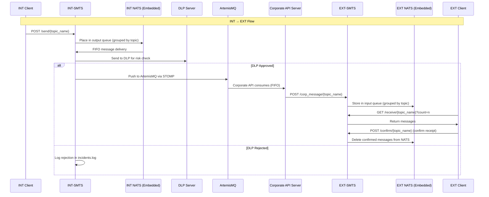
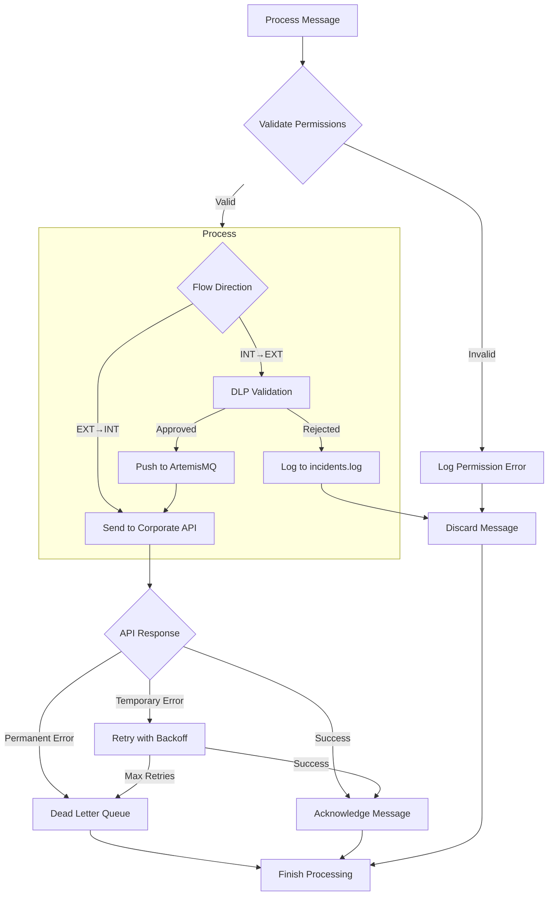

# SMTS (Secure Message Transport System)

A Golang service for secure message transport between isolated corporate networks using NATS JetStream as the message backbone.

## Overview

SMTS provides secure message transport between isolated corporate networks (EXT and INT) with the following features:

- **Embedded NATS JetStream**: Self-contained message broker
- **JSON Raw Type**: Flexible message format with raw JSON body support
- **DLP Validation**: Data Loss Prevention integration for INT network
- **ArtemisMQ Integration**: Cross-network message flow via ArtemisMQ
- **Configuration-Driven**: Behavior determined by YAML configuration files
- **JSON raw**: type for flexible message content
- **Unified Codebase**: Single codebase for both EXT and INT deployments

## Architecture

### Network Deployments

- **EXT SMTS**: Deployed in external corporate network
- **INT SMTS**: Deployed in secured internal network

### Message Flow Overview

SMTS implements bidirectional message flows between EXT and INT networks with durable NATS queues and ArtemisMQ integration.

## Flow 1: EXT → INT Message Flow

**Path:** EXT Client → EXT-SMTS → Corporate API → ArtemisMQ → INT-SMTS → INT Client



## Flow 2: INT → EXT Message Flow

**Path:** INT Client → INT-SMTS → DLP → ArtemisMQ → Corporate API → EXT-SMTS → EXT Client



## System Architecture Overview

```mermaid
flowchart TD
    subgraph EXT Network
        EC[EXT Client]
        ES[EXT-SMTS Server]
        EN[EXT NATS<br/>Embedded]
    end

    subgraph INT Network
        IC[INT Client]
        IS[INT-SMTS Server]
        IN[INT NATS<br/>Embedded]
        DL[DLP Server]
    end

    subgraph Corporate Infrastructure
        CA[Corporate API Server]
        AM[ArtemisMQ]
    end

    %% Flow 1: EXT → INT
    EC -->|POST /send/{topic}| ES
    ES -->|Output Queue| EN
    EN -->|FIFO| ES
    ES -->|POST /topic_name| CA
    CA -->|Push| AM
    AM -->|Pull| IS
    IS -->|Input Queue| IN
    IC -->|GET /receive/{topic}| IS
    IC -->|POST /confirm/{topic}| IS
    IS -->|Delete| IN

    %% Flow 2: INT → EXT
    IC -->|POST /send/{topic}| IS
    IS -->|Output Queue| IN
    IN -->|FIFO| IS
    IS -->|DLP Check| DL
    DL -->|Approved/Rejected| IS
    IS -->|STOMP Push| AM
    AM -->|FIFO| CA
    CA -->|POST /corp_message/{topic}| ES
    ES -->|Input Queue| EN
    EC -->|GET /receive/{topic}| ES
    EC -->|POST /confirm/{topic}| ES
    ES -->|Delete| EN
```

## Key Features

- **Durable NATS Queues**: All NATS queues are durable with workqueue retention
- **FIFO Processing**: Messages processed in strict first-in-first-out order
- **Topic-Based Grouping**: Messages grouped by topic names in both input/output queues
- **DLP Integration**: Risk-based validation for INT → EXT flow
- **Confirmation Mechanism**: Clients confirm receipt before message deletion
- **Bidirectional Flow**: Full support for both EXT→INT and INT→EXT message flows

## Error Handling Flow



## Quick Start

### Prerequisites

- Go 1.25
- Docker (for containerized deployment)

### Installation

Запуск тестов (полный набор):

```bash
docker-compose -f docker-compose.test.yml build && docker-compose -f docker-compose.test.yml up -d
```

Стенд:
```bash
docker-compose -f docker-compose.test.yml --profile test-runner up -d smts-test-runner
```

Вшение демо-сценарии:
```bash
./test-message-flow.sh
```

Результаты в папке /docker-logs

Build the applications:
```bash
# Build EXT deployment
go build -o bin/ext-smts ./cmd/ext-smts

# Build INT deployment
go build -o bin/int-smts ./cmd/int-smts
```

### Configuration

#### Environment Variables

```bash
# Required for both deployments
export API_KEY=corporate_api_key_here

# Required for INT deployment only
export ARTEMIS_USER=artemis_username
export ARTEMIS_PASSWORD=artemis_password


#### Configuration Files

- `configs/ext-config.yaml` - EXT network configuration
- `configs/int-config.yaml` - INT network configuration  
- `configs/topics.yaml` - Topics and privileges configuration

### Running the Service

#### EXT Deployment
```bash
./bin/ext-smts --config configs/ext-config.yaml
```

#### INT Deployment
```bash
./bin/int-smts --config configs/int-config.yaml
```

#### Health Check
```bash
./bin/ext-smts --health-check --config configs/ext-config.yaml
```

## Configuration Details

### Main Configuration Structure

```yaml
deployment:
  type: "int"  # or "ext"
  name: "smts-ext-prod"
  environment: "production"

nats:
  embedded: true
  host: "localhost"
  port: 4222
  stream:
    name: "SMTS_EXT"
    subjects: ["monterra.>", "pact_update.>"]
    retention: "workqueue"
    max_age: "24h"
    storage: "file"
    replicas: 1

api:
  base_url: "https://api.corporate.com"
  timeout: "30s"
  auth:
    type: "api_key"
    api_key: "${API_KEY}"

dlp: # int only
  enabled: true
  endpoint: "https://dlp.corporate.com/validate"
  timeout: "10s"
  retry:
    max_attempts: 2
    backoff: "1s"

artemis:  # int only
  enabled: true
  host: "artemis"
  port: 61613
  queue: "SMTS_INT_QUEUE"
  username: "${ARTEMIS_USER}"
  password: "${ARTEMIS_PASSWORD}"
```

### Topics Configuration

```yaml
topics:
  monterra:
    description: "Monterra events topic"
    permissions:
      read: ["ext_reader", "int_reader"]
      write: ["ext_writer", "int_writer"]

roles:
  ext_reader:
    description: "EXT network message reader"
    topics: ["monterra", "pact_update"]
```

## Message Format

### JSON Message Structure

```json
{
  "id": "uuid-v4",
  "timestamp": "2025-09-29T16:34:17Z",
  "topic": "monterra.event",
  "source": "ext_smts",
  "headers": {
    "content-type": "application/json",
    "correlation-id": "uuid-v4"
  },
  "body": "base64_encoded_raw_data"
}
```

## API Integration

### Client-Facing SMTS Endpoints

#### POST /send/{topic_name}
- **Description**: Send message to specified topic
- **Authentication**: API Key (X-API-Key header)
- **Request Body**: Message data in JSON format
- **Response**: 200 OK with message ID on success

#### GET /receive/{topic_name}?count=n
- **Description**: Retrieve up to n messages from specified topic
- **Authentication**: API Key (X-API-Key header)
- **Response**: Array of messages with metadata

#### POST /confirm/{topic_name}
- **Description**: Confirm receipt and deletion of messages
- **Authentication**: API Key (X-API-Key header)
- **Request Body**: Array of message IDs to confirm
- **Response**: 200 OK on successful deletion

### Internal Integration Endpoints

#### POST /topic_name (Corporate API)
- **Authentication**: API Key (X-API-Key header)
- **Request Body**: Raw message data
- **Response**: 200 OK on success

#### POST /validate (DLP Endpoint)
- **Authentication**: API Key (X-API-Key header)
- **Request Body**: Message content for validation
- **Response**: Approval/Rejection with reasons

#### POST /corp_message/{topic_name} (Corporate API → EXT-SMTS)
- **Authentication**: API Key (X-API-Key header)
- **Request Body**: Message data from corporate network
- **Response**: 200 OK on successful storage


## Deployment

### Docker Deployment

#### EXT Deployment
```bash
docker build -t smts-ext .
docker run -d \
  --name smts-ext \
  -p 8080:8080 \
  -e API_KEY=your_api_key \
  -v $(pwd)/configs:/app/configs \
  smts-ext
```

#### INT Deployment
```bash
docker build -t smts-int .
docker run -d \
  --name smts-int \
  -p 8080:8080 \
  -e API_KEY=your_api_key \
  -e ARTEMIS_USER=artemis_user \
  -e ARTEMIS_PASSWORD=artemis_password \
  -v $(pwd)/configs:/app/configs \
  smts-int
```

### Debug Mode

Enable debug logging for detailed troubleshooting:

```yaml
logging:
  level: "debug"
  format: "console"  # Human-readable format for debugging
```

## Health Monitoring

### Health Endpoints

- `GET /health` - Comprehensive health check
- `GET /ready` - Readiness probe
- `GET /live` - Liveness probe
- `GET /metrics` - Metrics endpoint (future)

### Health Check Request

```bash
#!/bin/bash
# health-check.sh
URL="http://localhost:8080/health"
response=$(curl -s -w "%{http_code}" $URL)
http_code=$(tail -n1 <<< "$response")
content=$(sed '$ d' <<< "$response")

if [ $http_code -eq 200 ]; then
    echo "Health check PASSED"
    exit 0
else
    echo "Health check FAILED: HTTP $http_code"
    echo "$content"
    exit 1
fi
```

### Health Check Response
```json
{
  "status": "healthy",
  "timestamp": "2025-09-23T16:34:17Z",
  "uptime": "5m30s",
  "version": "1.0.0",
  "deployment": {
    "type": "ext",
    "name": "smts-ext-prod",
    "environment": "production"
  },
  "checks": {
    "process": {"status": "healthy", "details": "Process is running"},
    "uptime": {"status": "healthy", "details": "5m30s", "seconds": 330},
    "overall": {"status": "healthy", "details": "Overall system health"}
  }
}
```

## Security Considerations

- All external calls use TLS encryption
- API key authentication for corporate endpoints
- DLP validation for INT-bound messages
- No sensitive data in logs
- Topic-level permission enforcement
