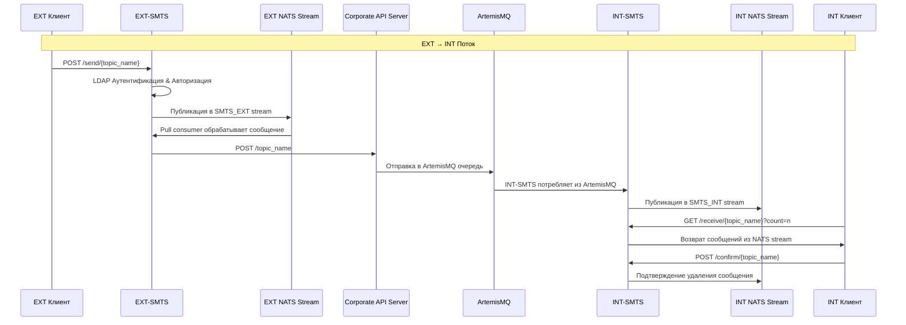
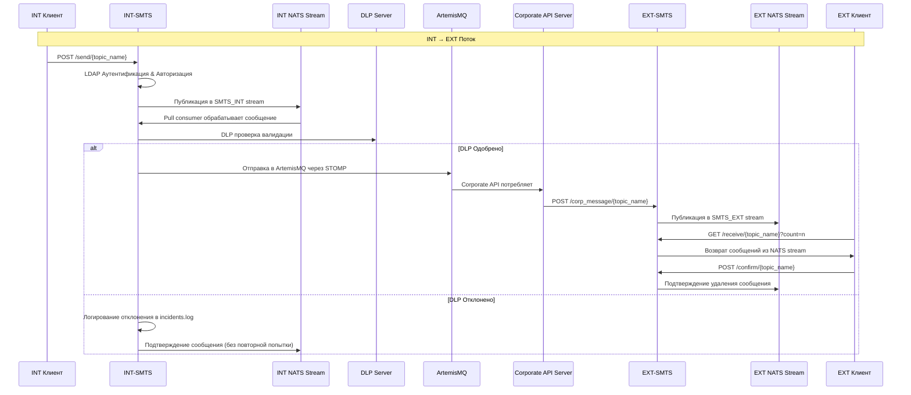
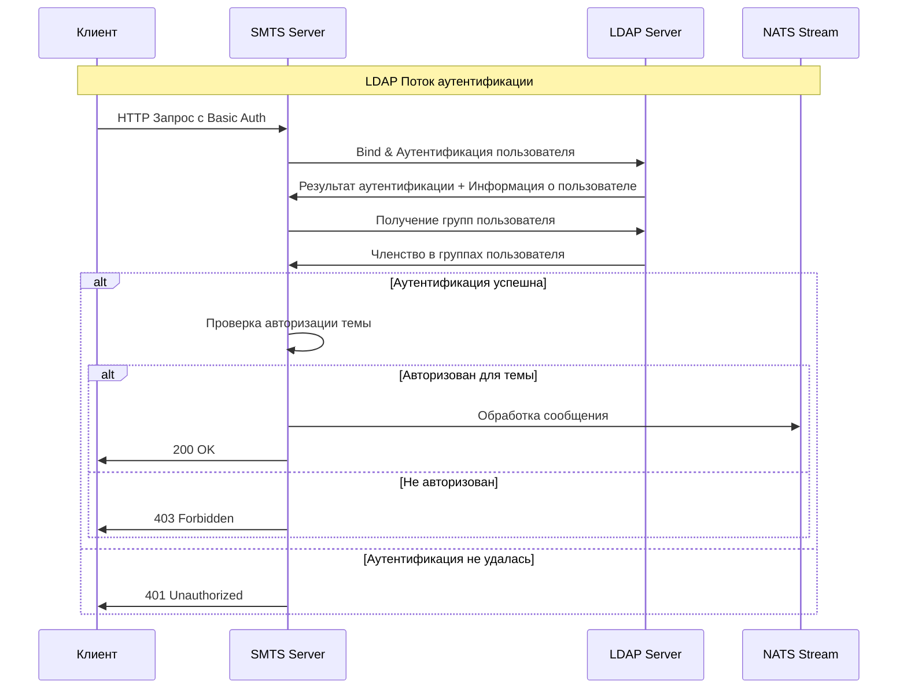
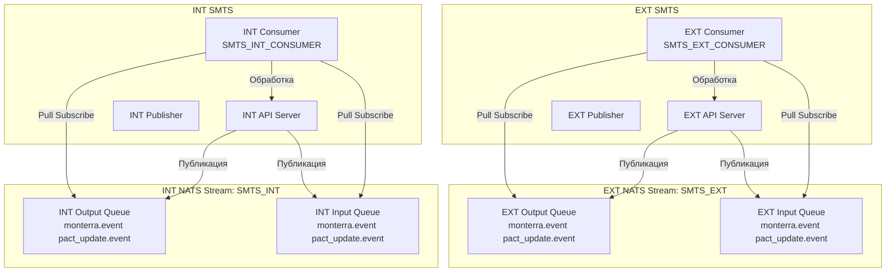
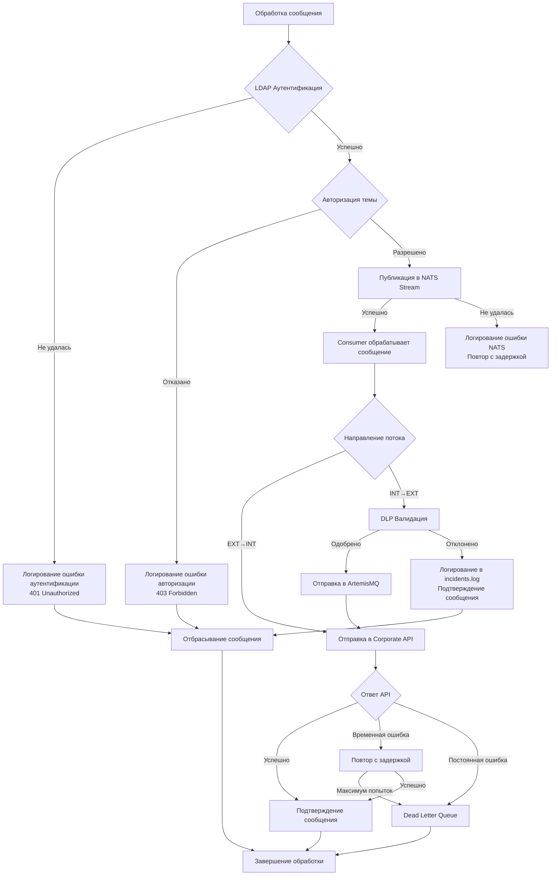

# SMTS (Secure Message Transport System)

Сервис на Golang для безопасной передачи сообщений между изолированными корпоративными сетями с использованием NATS JetStream в качестве бэкбона сообщений.

## Обзор

SMTS обеспечивает безопасную передачу сообщений между изолированными корпоративными сетями (EXT и INT) со следующими функциями:

- **Встроенный NATS JetStream**: Автономный брокер сообщений
- **JSON Raw Type**: Гибкий формат сообщений с поддержкой сырого JSON тела
- **DLP Валидация**: Интеграция Data Loss Prevention для сети INT
- **ArtemisMQ Интеграция**: Передача сообщений между сетями через ArtemisMQ
- **Конфигурационное управление**: Поведение определяется YAML конфигурационными файлами
- **JSON raw**: тип для гибкого содержимого сообщений
- **Унифицированная кодовая база**: Единая кодовая база для обоих развертываний EXT и INT

## Архитектура

### Сетевые развертывания

- **EXT SMTS**: Развертывается во внешней корпоративной сети
- **INT SMTS**: Развертывается в защищенной внутренней сети

### Обзор потока сообщений

SMTS реализует двунаправленные потоки сообщений между сетями EXT и INT с долговременными NATS очередями и интеграцией ArtemisMQ.

## Поток 1: EXT → INT Поток сообщений

**Путь:** EXT Клиент → EXT-SMTS → Corporate API → ArtemisMQ → INT-SMTS → INT Клиент



## Поток 2: INT → EXT Поток сообщений

**Путь:** INT Клиент → INT-SMTS → DLP → ArtemisMQ → Corporate API → EXT-SMTS → EXT Клиент



## Ключевые функции

- **Долговременные NATS Streams**: Выделенные NATS JetStream streams с политикой сохранения workqueue
- **LDAP Аутентификация**: Централизованная аутентификация и авторизация пользователей
- **FIFO Обработка**: Сообщения обрабатываются в строгом порядке "первым пришел - первым обслужен"
- **Группировка по темам**: Сообщения группируются по названиям тем в выделенных streams
- **DLP Интеграция**: Валидация на основе рисков для INT → EXT потока
- **Механизм подтверждения**: Клиенты подтверждают получение перед удалением сообщения
- **Двунаправленный поток**: Полная поддержка как EXT→INT, так и INT→EXT потоков сообщений

## LDAP Аутентификация & Авторизация

SMTS интегрируется с LDAP серверами для централизованного управления пользователями и детализированного контроля доступа.

### Поток аутентификации



### Группы авторизации

SMTS использует членство в LDAP группах для детализированной авторизации:

- **ext_writer**: Права записи в EXT темы
- **ext_reader**: Права чтения из EXT тем
- **int_writer**: Права записи в INT темы
- **int_reader**: Права чтения из INT тем
- **admin**: Полный доступ ко всем темам

## Архитектура выделенных NATS Streams

SMTS использует выделенные NATS JetStream streams для каждого развертывания с политикой сохранения workqueue для надежной обработки сообщений.

### Архитектура Stream



### Конфигурация Stream

Каждое развертывание поддерживает отдельные NATS streams со следующими характеристиками:

- **Workqueue Retention**: Сообщения удаляются после успешного подтверждения
- **Durable Consumers**: Consumers переживают перезапуски сервера
- **Explicit Acknowledgments**: Ручное ack/nack для надежной обработки
- **File Storage**: Постоянное хранение сообщений
- **24-hour TTL**: Автоматическая очистка старых сообщений

#### Конфигурация EXT Stream
```yaml
nats:
  stream:
    name: "SMTS_EXT"
    subjects: ["monterra.event", "pact_update.event"]
    retention: "workqueue"
    max_age: "24h"
    storage: "file"
    replicas: 1
  consumer:
    durable_name: "SMTS_EXT_CONSUMER"
    ack_policy: "explicit"
    deliver_policy: "all"
```

#### Конфигурация INT Stream
```yaml
nats:
  stream:
    name: "SMTS_INT"
    subjects: ["monterra.event", "pact_update.event"]
    retention: "workqueue"
    max_age: "24h"
    storage: "file"
    replicas: 1
  consumer:
    durable_name: "SMTS_INT_CONSUMER"
    ack_policy: "explicit"
    deliver_policy: "all"
```

## Поток обработки ошибок



## Быстрый старт

### Предварительные требования

- Go 1.25
- Docker (для контейнерного развертывания)

### Установка

Запуск тестов (полный набор):

```bash
docker-compose -f docker-compose.test.yml build && docker-compose -f docker-compose.test.yml up -d
```

Стенд:
```bash
docker-compose -f docker-compose.test.yml --profile test-runner up -d smts-test-runner
```

Внешние демо-сценарии:
```bash
./test-message-flow.sh
```

Результаты в папке /docker-logs

Сборка приложений:
```bash
# Сборка EXT развертывания
go build -o bin/ext-smts ./cmd/ext-smts

# Сборка INT развертывания
go build -o bin/int-smts ./cmd/int-smts
```

### Конфигурация

#### Переменные окружения

```bash
# Требуется для обоих развертываний
export API_KEY=corporate_api_key_here

# Требуется только для INT развертывания
export ARTEMIS_USER=artemis_username
export ARTEMIS_PASSWORD=artemis_password


#### Файлы конфигурации

- `configs/ext-config.yaml` - конфигурация EXT сети
- `configs/int-config.yaml` - конфигурация INT сети
- `configs/topics.yaml` - конфигурация тем и привилегий

### Методы аутентификации

SMTS поддерживает несколько методов аутентификации для интеграции с корпоративным API:

#### Аутентификация по API ключу
```yaml
api:
  auth:
    type: "api_key"
    api_key: "${API_KEY}"
```

#### OAuth2 Client Credentials
```yaml
api:
  auth:
    type: "client_credentials"
    client_id: "${CLIENT_ID}"
    client_secret: "${CLIENT_SECRET}"
    token_url: "${TOKEN_URL}"
    scopes: "api"  # Опционально
```

**Переменные окружения для Client Credentials:**
```bash
export CLIENT_ID=your_client_id
export CLIENT_SECRET=your_client_secret
export TOKEN_URL=https://auth.corporate.com/oauth/token
```

**Функции:**
- Автоматическое кэширование и обновление токенов
- Обработка истечения срока действия токенов с 30-секундным буфером
- Безопасность конкурентных запросов с мьютексами
- Автоматический повтор при неудачном обновлении токенов

### Запуск сервиса

#### EXT Развертывание
```bash
./bin/ext-smts --config configs/ext-config.yaml
```

#### INT Развертывание
```bash
./bin/int-smts --config configs/int-config.yaml
```

#### Проверка здоровья
```bash
./bin/ext-smts --health-check --config configs/ext-config.yaml
```

## Детали конфигурации

### Основная структура конфигурации

```yaml
deployment:
  type: "int"  # или "ext"
  name: "smts-ext-prod"
  environment: "production"

nats:
  embedded: true
  host: "localhost"
  port: 4222
  stream:
    name: "SMTS_EXT"
    subjects: ["monterra.event", "pact_update.event"]
    retention: "workqueue"
    max_age: "24h"
    storage: "file"
    replicas: 1

api:
  base_url: "https://api.corporate.com"
  timeout: "30s"
  auth:
    type: "api_key"  # Опции: "api_key", "client_credentials"
    api_key: "${API_KEY}"  # Используется когда type "api_key"
    client_id: "${CLIENT_ID}"  # Используется когда type "client_credentials"
    client_secret: "${CLIENT_SECRET}"  # Используется когда type "client_credentials"
    token_url: "${TOKEN_URL}"  # Используется когда type "client_credentials"
    scopes: "api"  # Опциональные scopes для client credentials

dlp: # только для int
  enabled: true
  endpoint: "https://dlp.corporate.com/validate"
  timeout: "10s"
  retry:
    max_attempts: 2
    backoff: "1s"

artemis:  # только для int
  enabled: true
  host: "artemis"
  port: 61613
  queue: "SMTS_INT_QUEUE"
  username: "${ARTEMIS_USER}"
  password: "${ARTEMIS_PASSWORD}"
```

### Конфигурация тем

```yaml
topics:
  monterra.event:
    description: "Monterra events topic"
  
  pact_update.event:
    description: "Pact update events topic"
```

## Формат сообщений

### Структура JSON сообщения

```json
{
  "id": "uuid-v4",
  "timestamp": "2025-09-29T16:34:17Z",
  "topic": "monterra.event",
  "source": "ext_smts",
  "headers": {
    "content-type": "application/json",
    "correlation-id": "uuid-v4"
 
  },
  "body": "base64_encoded_raw_data"
}
```

## API Интеграция

### Клиентские SMTS Endpoints

#### POST /send/{topic_name}
- **Описание**: Отправка сообщения в указанную тему
- **Аутентификация**: API Key (X-API-Key заголовок)
- **Тело запроса**: Данные сообщения в JSON формате
- **Ответ**: 200 OK с ID сообщения при успехе

#### GET /receive/{topic_name}?count=n
- **Описание**: Получение до n сообщений из указанной темы
- **Аутентификация**: API Key (X-API-Key заголовок)
- **Ответ**: Массив сообщений с метаданными

#### POST /confirm/{topic_name}
- **Описание**: Подтверждение получения и удаления сообщений
- **Аутентификация**: API Key (X-API-Key заголовок)
- **Тело запроса**: Массив ID сообщений для подтверждения
- **Ответ**: 200 OK при успешном удалении

### Внутренние интеграционные Endpoints

#### POST /topic_name (Corporate API)
- **Аутентификация**: API Key (X-API-Key заголовок)
- **Тело запроса**: Сырые данные сообщения
- **Ответ**: 200 OK при успехе

#### POST /validate (DLP Endpoint)
- **Аутентификация**: API Key (X-API-Key заголовок)
- **Тело запроса**: Содержимое сообщения для валидации
- **Ответ**: Одобрение/Отклонение с причинами

#### POST /corp_message/{topic_name} (Corporate API → EXT-SMTS)
- **Аутентификация**: API Key (X-API-Key заголовок)
- **Тело запроса**: Данные сообщения из корпоративной сети
- **Ответ**: 200 OK при успешном сохранении

## Развертывание

### Docker Развертывание

#### EXT Развертывание
```bash
docker build -t smts-ext .
docker run -d \
  --name smts-ext \
  -p 8080:8080 \
  -e API_KEY=your_api_key \
  -v $(pwd)/configs:/app/configs \
  smts-ext
```

#### INT Развертывание
```bash
docker build -t smts-int .
docker run -d \
  --name smts-int \
  -p 8080:8080 \
  -e API_KEY=your_api_key \
  -e ARTEMIS_USER=artemis_user \
  -e ARTEMIS_PASSWORD=artemis_password \
  -v $(pwd)/configs:/app/configs \
  smts-int
```

### Режим отладки

Включите debug логирование для детального устранения неполадок:

```yaml
logging:
  level: "debug"
  format: "console"  # Человекочитаемый формат для отладки
```

## Мониторинг здоровья

### Health Endpoints

- `GET /health` - Комплексная проверка здоровья
- `GET /ready` - Проверка готовности
- `GET /live` - Проверка жизнеспособности
- `GET /metrics` - Endpoint метрик (в будущем)

### Запрос проверки здоровья

```bash
#!/bin/bash
# health-check.sh
URL="http://localhost:8080/health"
response=$(curl -s -w "%{http_code}" $URL)
http_code=$(tail -n1 <<< "$response")
content=$(sed '$ d' <<< "$response")

if [ $http_code -eq 200 ]; then
    echo "Проверка здоровья ПРОЙДЕНА"
    exit 0
else
    echo "Проверка здоровья НЕ ПРОЙДЕНА: HTTP $http_code"
    echo "$content"
    exit 1
fi
```

### Ответ проверки здоровья
```json
{
  "status": "healthy",
  "timestamp": "2025-09-23T16:34:17Z",
  "uptime": "5m30s",
  "version": "1.0.0",
  "deployment": {
    "type": "ext",
    "name": "smts-ext-prod",
    "environment": "production"
  },
  "checks": {
    "process": {"status": "healthy", "details": "Процесс запущен"},
    "uptime": {"status": "healthy", "details": "5m30s", "seconds": 330},
    "overall": {"status": "healthy", "details": "Общее состояние системы"}
  }
}
```

## Соображения безопасности

- Все внешние вызовы используют TLS шифрование
- Аутентификация по API ключу для корпоративных endpoints
- DLP валидация для сообщений, направляемых в INT
- Отсутствие чувствительных данных в логах
- Принудительное применение разрешений на уровне тем