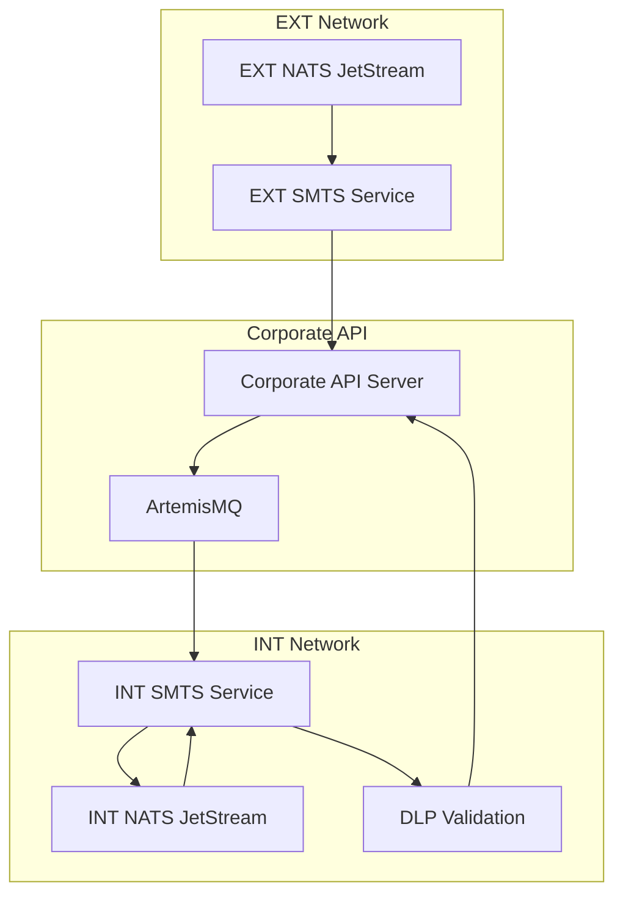
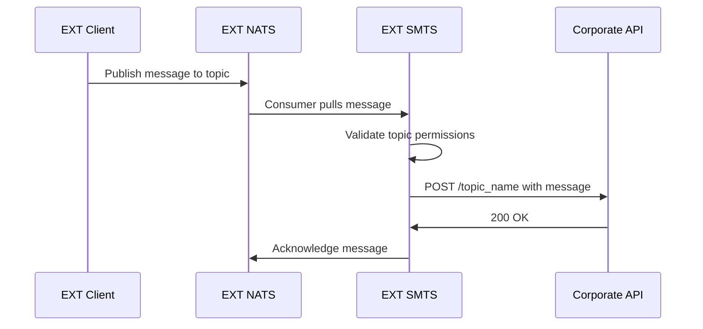
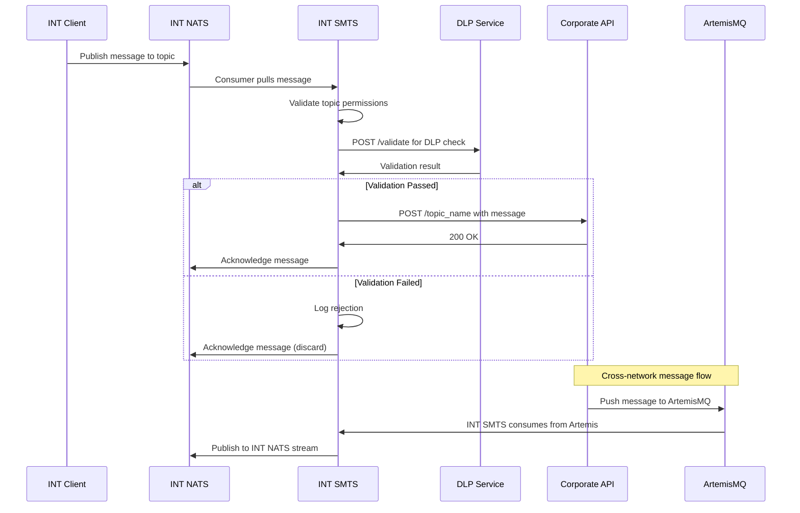
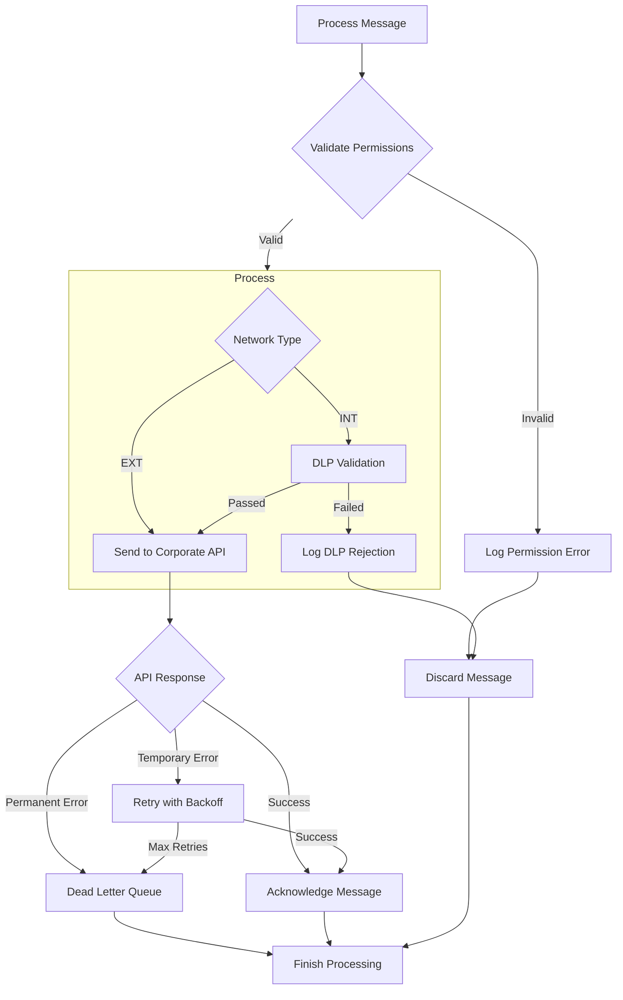

# SMTS Message Flow Diagrams

## System Message Flow



## Detailed EXT SMTS Flow



## Detailed INT SMTS Flow



## Error Handling Flow



## Configuration-Driven Behavior

The system uses configuration to determine behavior:

### EXT SMTS Configuration
```yaml
deployment: "ext"
nats:
  stream: "SMTS_EXT"
  consumer: "SMTS_EXT_CONSUMER"
api:
  endpoint: "https://api.corporate.com"
  auth_type: "api_key"
flow:
  dlp_validation: false
  artemis_consumer: false
```

### INT SMTS Configuration
```yaml
deployment: "int" 
nats:
  stream: "SMTS_INT"
  consumer: "SMTS_INT_CONSUMER"
api:
  endpoint: "https://api.corporate.com"
  auth_type: "api_key"
dlp:
  endpoint: "https://dlp.corporate.com/validate"
flow:
  dlp_validation: true
  artemis_consumer: true
```

## Security Considerations

1. **Network Isolation**: EXT and INT networks are physically separated
2. **API Authentication**: All corporate API calls use API key authentication
3. **Message Encryption**: Messages are base64 encoded for transport
4. **Access Control**: Topic-level permissions enforced via configuration
5. **DLP Validation**: All INT messages undergo data loss prevention checks